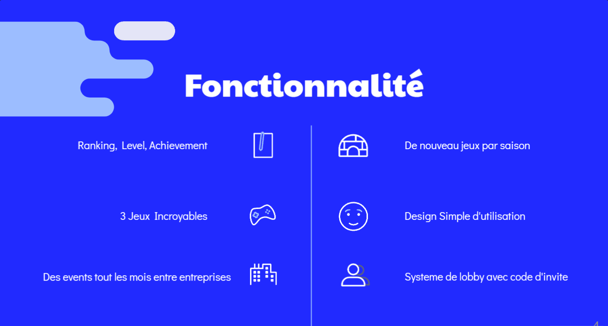

<h1 align="center">
	📖 OQuest - Hackaton Odoo 3
</h1>

<p align="center">
	<b><i>Mobile App for fun at the office</i></b><br>
</p>

<p align="center">
	
	
	
	
	
</p>

OQuest est une application mobile conçue pour apporter du divertissement, de l'engagement et une compétition saine sur le lieu de travail. L'application pourrait être utilisée par les employés de bureau pour organiser et participer à une série de mini-jeux ou de défis qui imitent les événements olympiques mais sont adaptés à l'environnement de bureau.

The project uses the following technologies:
- **React Native**
- **Flask**
- ****

# Usage

**Before starting**, please replace the `FORTYTWO_ID`, `FORTYTWO_SECRET` and `AUTH_CALLBACK` variables in `stage.dev.env` with your own (from the 42 API).<br>
Then, run the following command for the back and the front:

```bash
docker-compose up --build
```

If everything went well, you should be able to access the website at `http://localhost:8080`.
> If you'd like to modify additional settings, please feel free to do so in the others environment files.

> Upon first launch, you will be asked to authenticate with your 42 account.

# Docs

**NESTJS** documentation is available at `https://docs.nestjs.com/`.<br>
**SWAGGER** (OAS 3.0) documentation is available at `https://swagger.io/specification/`. (I Heavily recommend the use of https://editor.swagger.io)<br>
**TYPEORM** documentation is available at `https://typeorm.io/`.<br>
# Screenshots





